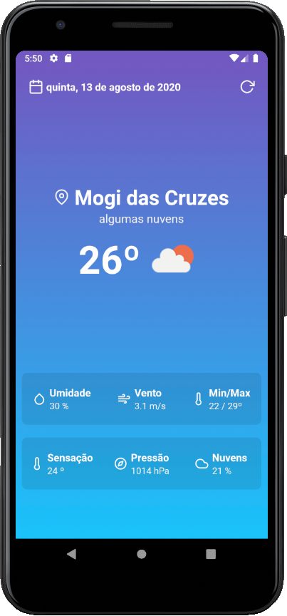
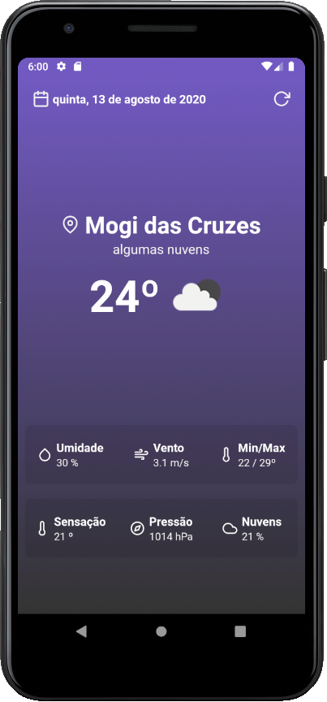

<h1 align="center">
	Weatherapp
</h1>

<h3 align="center">Weatherapp - aplicação simples desenvolvida com React Native que mostra os dados do clima com base nas cordenadas do usuário.</h3>

<p align="center">
  

  
</p>

## 🛠 Tecnologias

As seguintes ferramentas foram usadas na construção do projeto:

- [React Native](https://reactnative.dev/)
- [react-native-community/geolocation](https://github.com/react-native-community/react-native-geolocation)
- [styled-components](https://styled-components.com/)
- [axios](https://github.com/axios/axios)
- [date-fns](https://date-fns.org/)
- [react-native-vector-icons](https://github.com/oblador/react-native-vector-icons)
- [react-native-linear-gradient](https://github.com/react-native-community/react-native-linear-gradient)


## Pré-requisitos

Antes de começar, você vai precisar ter instalado em sua máquina as seguintes ferramentas:
[Git](https://git-scm.com), [Node.js](https://nodejs.org/en/), [Expo](https://expo.io/), [Yarn](https://classic.yarnpkg.com/lang/en/). 
Além disto é bom ter um editor para trabalhar com o código como [VSCode](https://code.visualstudio.com/)

## 💾 Instalação

```bash
	# Acesse a pasta do projeto no terminal/cmd
	$ cd weatherapp

	# Instale as dependências
	$ yarn

  # Instale o app no emuulador
  $ yarn android

	# Execute a aplicação
	$ yarn start
```

---
By Rodrigo Sakamoto

[](https://www.linkedin.com/in/rodrigo-sakamoto/) 
[](mailto:rodosakamoto@gmail.com)
